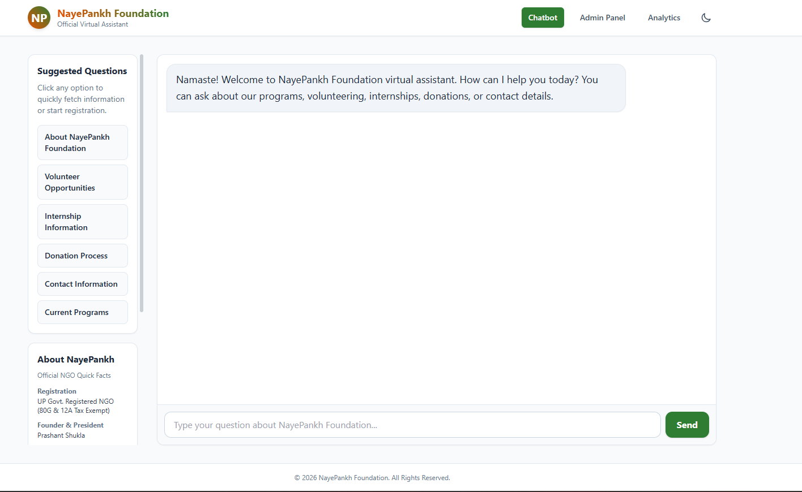
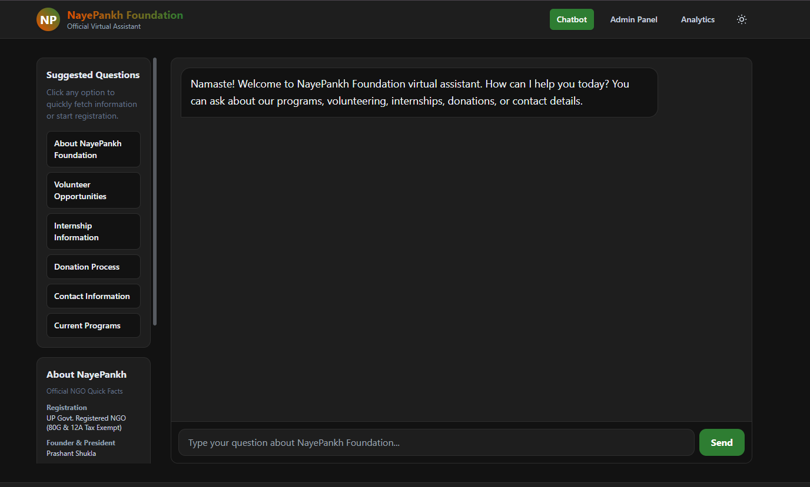
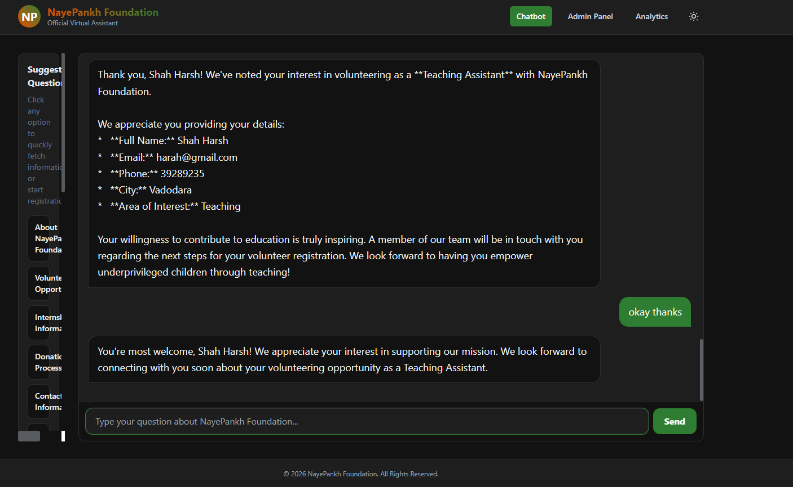
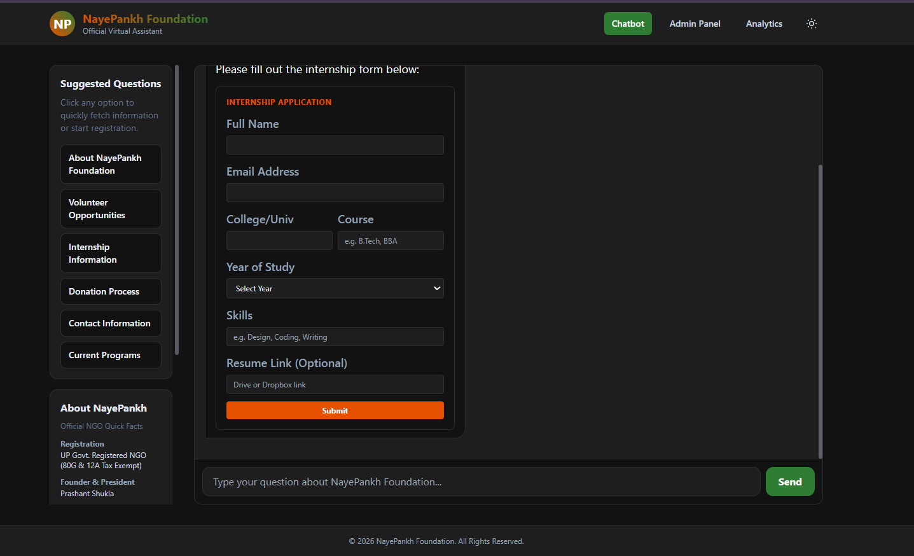
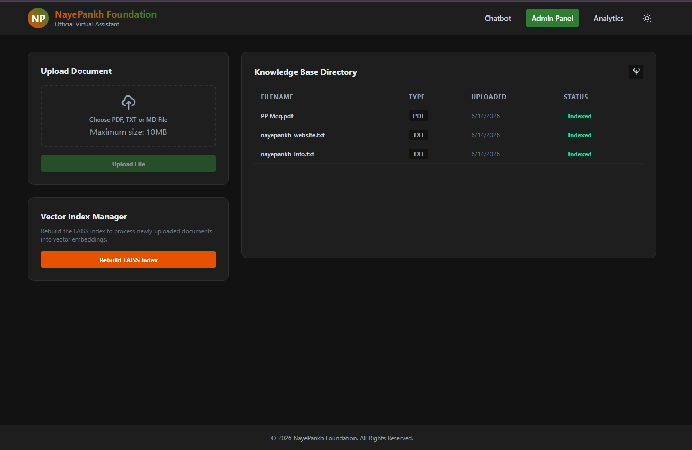
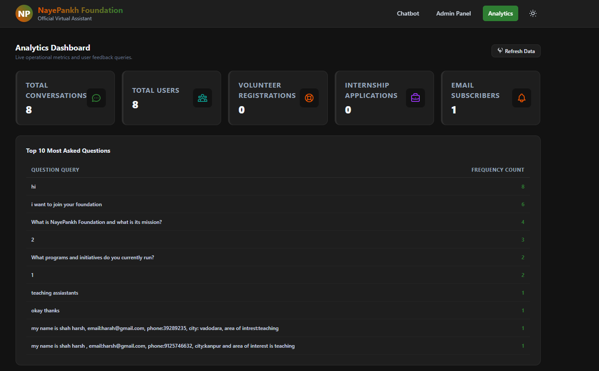

# NayePankh Foundation AI Chatbot

A production-ready AI chatbot web application designed for NayePankh Foundation. It functions as an official virtual assistant to answer queries regarding the NGO's mission, volunteering, internships, donations, and contact details. It is equipped with a RAG pipeline utilizing a FAISS vector database and the Gemini 2.5 Flash API.

## Project Structure

```text
## 📂 Project Structure

```text
project/
├── backend/
│   ├── app/
│   │   ├── config.py
│   │   ├── database.py
│   │   ├── gemini.py
│   │   ├── main.py
│   │   └── rag.py
│   ├── faiss_index/
│   │   ├── chunks.json
│   │   └── index.faiss
│   ├── requirements.txt
│   └── .env.example
├── database/
│   └── nayepankh.db
├── frontend/
│   ├── src/
│   │   ├── components/
│   │   │   ├── AdminPanel.jsx
│   │   │   ├── AnalyticsDashboard.jsx
│   │   │   └── Chatbot.jsx
│   │   ├── App.jsx
│   │   ├── index.css
│   │   └── main.jsx
│   ├── tailwind.config.js
│   └── package.json
├── knowledge_base/
│   └── nayepankh_info.txt
├── screenshot/
│   ├── chatbot-light.png
│   ├── chatbot-dark.png
│   ├── conversation.png
│   ├── internship-form.png
│   ├── admin-panel.png
│   └── analytics-dashboard.png
└── README.md
```
## 📸 Project Screenshots

### 🏠 Chatbot Home (Light Theme)



---

### 🌙 Chatbot Home (Dark Theme)



---

### 💬 AI Chat Conversation



---

### 📝 Internship Registration Form



---

### 👨‍💼 Admin Panel



---

### 📊 Analytics Dashboard



## Features

1. **AI Chat Assistant**: Provides answers to visitor queries based strictly on the uploaded knowledge base context. Uses Gemini 2.5 Flash.
2. **RAG Pipeline**: Splits uploaded documentation (PDF, TXT, MD) into coherent chunks, generates embeddings using `models/text-embedding-004`, and indexes them in a local FAISS database.
3. **Bilingual Support**: Handles English and Hindi user inputs and translates/replies in the respective language.
4. **Interactive Flows**: Captures Volunteer registrations and Internship applications using interactive forms directly inside the chat window, storing them in SQLite.
5. **Admin Dashboard**: Enables admins to upload new documentation files, view lists of uploaded files, and trigger indexing.
6. **Analytics Dashboard**: Tracks chatbot conversation metrics, total user count, registration counts, and displays the top 10 most-asked questions.

## Getting Started

### Prerequisites

- Python 3.10+
- Node.js v18+
- Gemini API Key (from Google AI Studio)

### Quick Run (Windows)
If you are on Windows and have already installed the backend and frontend dependencies, you can start both servers simultaneously by double-clicking the `run_project.bat` file in the root directory.

### Backend Configuration & Installation

1. Navigate to the backend directory:
   ```bash
   cd backend
   ```

2. Create a virtual environment:
   ```bash
   python -m venv venv
   ```

3. Activate the virtual environment:
   - **Windows (PowerShell)**: `venv\Scripts\Activate.ps1`
   - **Windows (Command Prompt)**: `venv\Scripts\activate.bat`
   - **macOS/Linux**: `source venv/bin/activate`

4. Install the required Python dependencies:
   ```bash
   pip install -r requirements.txt
   ```

5. Create a `.env` file inside the `backend` folder:
   ```env
   GEMINI_API_KEY=your_gemini_api_key_here
   ```

6. Start the FastAPI development server:
   ```bash
   uvicorn app.main:app --reload
   ```
   The backend API will be available at `http://localhost:8000`.

### Frontend Configuration & Installation

1. Navigate to the frontend directory:
   ```bash
   cd frontend
   ```

2. Install the frontend dependencies:
   ```bash
   npm install
   ```

3. Start the Vite React development server:
   ```bash
   npm run dev
   ```
   The frontend application will be running at `http://localhost:5173`.

## Usage & Verification

- Open `http://localhost:5173` in your browser.
- **Chatbot Tab**: Select suggested questions or converse in English/Hindi. To open registration forms, click on "Volunteer Opportunities", "Internship Information", or type messages indicating intent to volunteer or apply for an internship.
- **Admin Tab**: Upload documents (`.pdf`, `.txt`, `.md`) and click "Rebuild FAISS Index" to ingest them into the vector database.
- **Analytics Tab**: View live conversational trends and query frequency counts.

## Sharing the Project & Troubleshooting

### "Fatal error in launcher" when running commands
If a recipient encounters a `Fatal error in launcher: Unable to create process...` error when attempting to run backend commands, it means they are using a copied `venv` folder.
To resolve this:
1. Delete the `backend/venv` folder on the new machine.
2. Open the terminal in the `backend/` directory and recreate the environment:
   ```bash
   python -m venv venv
   venv\Scripts\pip install -r requirements.txt
   ```
3. Restart the backend server:
   ```bash
   venv\Scripts\python -m uvicorn app.main:app --reload
   ```
